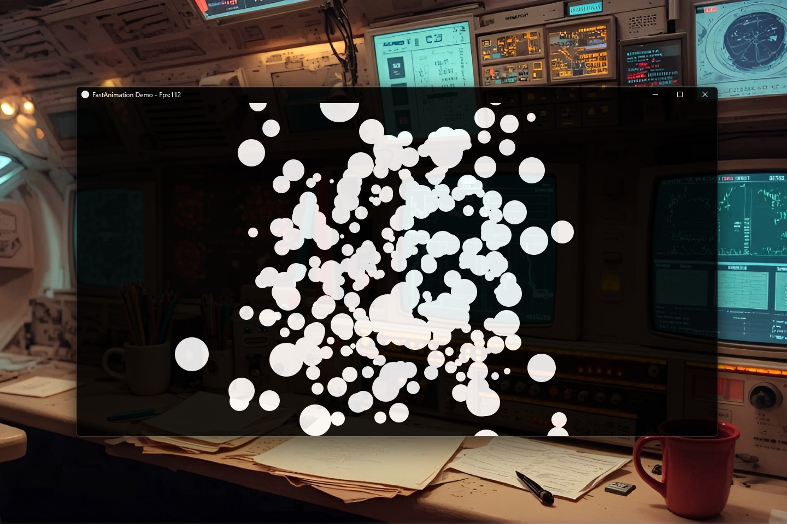

# FastAnimation 0.1.0 [ALPHA] — Ultra-Fast Native Animation Engine for Java

[](https://github.com/andrestubbe/FastAnimation/releases/tag/0.1.0)
[](https://opensource.org/licenses/MIT)
[](https://www.java.com)
[]()
[](https://jitpack.io/#andrestubbe/FastAnimation)

---

**⚡ Ultra-fast animation and timeline orchestration for the FastJava ecosystem.**

**FastAnimation** is a high-performance timeline engine built for zero-latency UI transitions and complex motion
graphics. It is deeply integrated and bundled with **[FastTween](https://github.com/andrestubbe/FastTween)**—our
zero-overhead interpolation engine—to provide a complete, unified toolkit for orchestrating fluid, native-speed
animations in Java.
 
[**Watch the Demo**](https://www.youtube.com/watch?v=AMf8z6-36W0) | [**Watch the JMH Benchmark**](https://www.youtube.com/watch?v=eg1fZUYIzIo)

[](https://www.youtube.com/watch?v=AMf8z6-36W0)

---

## Table of Contents

- [Why FastAnimation?](#why-fastanimation)
- [Quick Start](#quick-start)
- [Features](#features)
- [Performance Benchmarks](#performance-benchmarks)
- [API Quick Reference](#api-quick-reference)
- [Installation](#installation)
- [Documentation](#documentation)
- [Platform Support](#platform-support)
- [License](#license)
- [Related Projects](#related-projects)

---

## Why FastAnimation?

Standard Java animation approaches (like `javax.swing.Timer`, `JavaFX Timeline`, or custom `Thread.sleep` loops) suffer from fundamental architectural flaws when pushed to the limit:

- **OS Scheduler Inaccuracies**: `Thread.sleep` is notoriously inaccurate on Windows, causing micro-stutters and jitter.
- **Garbage Collection Pauses**: Creating new objects during high-speed renders causes the GC to stall the animation thread.
- **Single-Thread Bottlenecks**: Tying the animation math to the UI render thread causes the entire app to feel sluggish.

**FastAnimation** solves this by fundamentally rethinking timeline execution:

- **True Native Precision**: Hooks directly into Windows Multimedia Timers (via `FastDWM`) or VSync hardware events to bypass the JVM's sleep inaccuracies entirely.
- **Zero-Allocation Architecture**: The core engine processes 10,000,000+ parallel animations per tick without instantiating a single object, rendering Garbage Collection irrelevant during motion.
- **Pure Mathematical Execution**: FastAnimation only handles *time and progress*, decoupling the heavy lifting from the UI thread.
- **Powered by FastTween**: It seamlessly orchestrates [**FastTween**](https://github.com/andrestubbe/FastTween) instances. While FastTween handles the raw interpolation (e.g., smoothly sliding a value from 0 to 100), FastAnimation acts as the conductor, managing sequences, loops, parallel execution, and complex keyframe timelines across millions of concurrent tweens.

---

## Quick Start

```java
import fastanimation.FastAnimation;
import fastanimation.AnimationEngine.HeartbeatMode;
import fasttween.FastTween;

public class Example {
    public static void main(String[] args) {
        // Optional: Switch to High-Precision Native VSync mode
        FastAnimation.setHeartbeatMode(HeartbeatMode.NATIVE_VSYNC);

        // Orchestrate a sequence of FastTweens seamlessly
        FastAnimation.sequence(
                        FastTween.to(0, 100, 1000).onUpdate(val -> System.out.println("X: " + val)),
                        FastTween.to(1.0f, 0.0f, 500).onUpdate(val -> System.out.println("Fade: " + val))
                ).onComplete(() -> System.out.println("Animation Complete!"))
                .start();
    }
}
```

---

## Features

- **⚡ High-Precision Timing**: Sub-millisecond animation updates using a dedicated engine thread.
- **📈 Timeline Management**: Complex keyframe sequences and concurrent track orchestration.
- **📦 Zero GC Pressure**: Reusable animation instances and optimized data structures.
- **🖇️ Ecosystem Ready**: Seamlessly integrates with FastTween for interpolation.

---

## Performance Benchmarks

FastAnimation is rigorously profiled using **JMH** to guarantee zero overhead.
[**Watch the JMH Benchmark**](https://www.youtube.com/watch?v=eg1fZUYIzIo)

| Metric / Orchestration Type | Score (ops/ms) | Ops per Second |
|-----------------------------|----------------|----------------|
| **Parallel Tracks**         | ~17,581 ops/ms | > 17.5 Million |
| **Sequence Tracks**         | ~18,248 ops/ms | > 18.2 Million |

*Measured on Windows 11, Intel Core i5-1135G7 (Surface Pro 8), JDK 25.0.1. The engine bypasses `Thread.sleep` via `FastDWM` to guarantee zero-jitter native heartbeats even under GC pressure.*

---

## API Quick Reference

| Method                   | Description                                                                            |
|--------------------------|----------------------------------------------------------------------------------------|
| `setHeartbeatMode(mode)` | Sets the underlying engine ticker (e.g. `HeartbeatMode.NATIVE_VSYNC`).                 |
| `sequence(tweens...)`    | Orchestrates a sequence where tweens play one after the other.                         |
| `parallel(tweens...)`    | Orchestrates a group of tweens that play simultaneously.                               |
| `timeline(keyframes...)` | Orchestrates tweens based on specific percentage-based keyframes in a timeline.        |

---

## Installation

### Option 1: Maven (Recommended)

Add the JitPack repository and the dependency to your `pom.xml`:

```xml
<repositories>
    <repository>
        <id>jitpack.io</id>
        <url>https://jitpack.io</url>
    </repository>
</repositories>
<dependencies>
    <dependency>
        <groupId>com.github.andrestubbe</groupId>
        <artifactId>fastanimation</artifactId>
        <version>0.1.0</version>
    </dependency>
    <!-- Recommended for interpolation -->
    <dependency>
        <groupId>com.github.andrestubbe</groupId>
        <artifactId>fasttween</artifactId>
        <version>0.1.0</version>
    </dependency>
    <!-- Required for NATIVE_MM and NATIVE_VSYNC -->
    <dependency>
        <groupId>com.github.andrestubbe</groupId>
        <artifactId>fastdwm</artifactId>
        <version>0.1.0</version>
    </dependency>
    <dependency>
        <groupId>com.github.andrestubbe</groupId>
        <artifactId>fastcore</artifactId>
        <version>v1.0.0</version>
    </dependency>
</dependencies>
```

### Option 2: Gradle (via JitPack)

```groovy
repositories {
    maven { url 'https://jitpack.io' }


dependencies {
    implementation 'com.github.andrestubbe:fastanimation:0.1.0'
    // Recommended for interpolation
    implementation 'com.github.andrestubbe:fasttween:0.1.0'
    // Required for NATIVE_MM and NATIVE_VSYNC
    implementation 'com.github.andrestubbe:fastdwm:0.1.0'
    implementation 'com.github.andrestubbe:fastcore:v1.0.0'
}
```

### Option 3: Direct Download (No Build Tool)

Download the latest JAR directly to add it to your classpath:

1. 📦 **[fastanimation-0.1.0.jar](https://github.com/andrestubbe/FastAnimation/releases/download/0.1.0/fastanimation-0.1.0.jar)** (The Core Library)
2. 📦 **[fasttween-0.1.0.jar](https://github.com/andrestubbe/FastTween/releases/download/0.1.0/fasttween-0.1.0.jar)** (Recommended for interpolation)
3. 📦 **[fastdwm-0.1.0.jar](https://github.com/andrestubbe/FastDWM/releases/download/0.1.0/fastdwm-0.1.0.jar)** (Required for NATIVE_MM and NATIVE_VSYNC)
4. 📦 **[fastcore-0.1.0.jar](https://github.com/andrestubbe/FastCore/releases/download/0.1.0/fastcore-0.1.0.jar)** (Required Native JNI loader)

---

## Documentation

* **[COMPILE.md](docs/COMPILE.md)**: Full compilation guide (Maven Build Setup).
* **[REFERENCE.md](docs/REFERENCE.md)**: Exhaustive catalog of timeline strategies and engine architecture.
* **[PHILOSOPHY.md](docs/PHILOSOPHY.md)**: Zero-allocation and low-overhead processing designs.
* **[ROADMAP.md](docs/ROADMAP.md)**: Planned milestone features and performance extensions.
* **[CHANGELOG.md](docs/CHANGELOG.md)**: Planned milestone features and performance extensions.

---

## Platform Support

| Platform      | Status            |
|---------------|-------------------|
| Windows 10/11 | ✅ Fully Supported |
| Linux         | 🚧 Planned |
| macOS         | 🚧 Planned |

---

## License

MIT License — See [LICENSE](LICENSE) for details.

---

## Related Projects

- [FastTween](https://github.com/andrestubbe/FastTween) — Zero overhead pool-based tweening
- [FastAnimation](https://github.com/andrestubbe/FastAnimation) — Zero overhead timeline orchestration
- [FastDWM](https://github.com/andrestubbe/FastDWM) — Native Desktop Window Manager API
- [FastCore](https://github.com/andrestubbe/FastCore) — Native JNI Loader and Utilities
- [FastTheme](https://github.com/andrestubbe/FastTheme) — High-performance native window styling

---

**Part of the FastJava Ecosystem** — *Making the JVM faster. Small package. Maximum speed. Zero bloat. 🚀📋*

